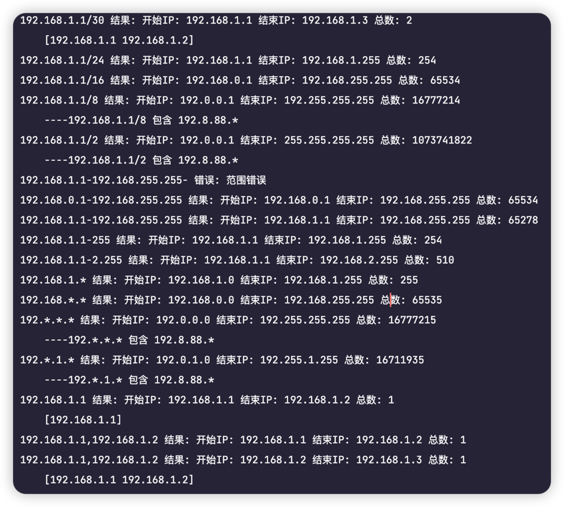

# ipRange 库

```text
// 支持如下格式
192.168.1.1/30
192.168.1.1/24
192.168.1.1/16
192.168.1.1/8
192.168.1.1/2
192.168.0.1-192.168.255.255
192.168.1.1-192.168.255.255
192.168.1.1-255
192.168.1.1-2.255
192.168.1.*
192.168.*.*
192.*.*.*
192.*.1.*
192.168.1.1
192.168.1.1,192.168.1.2
```


